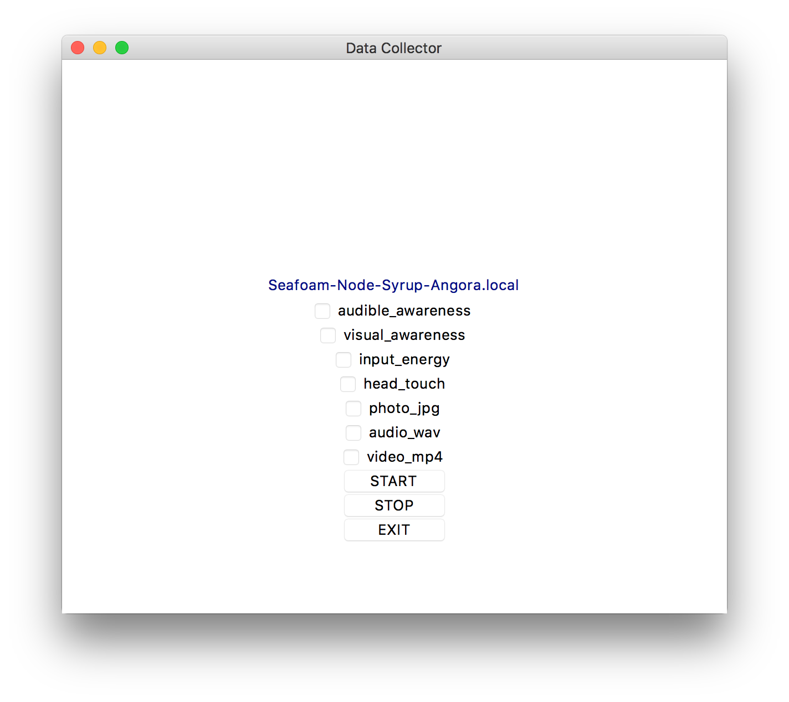
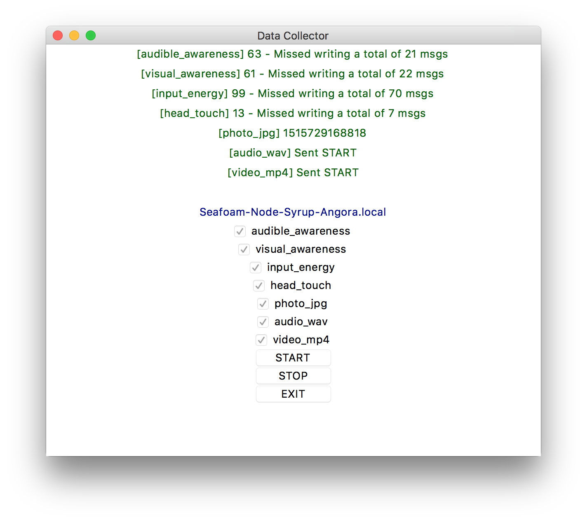
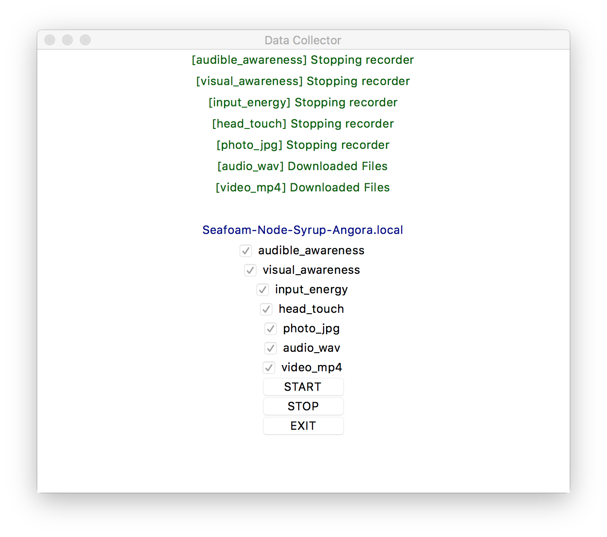
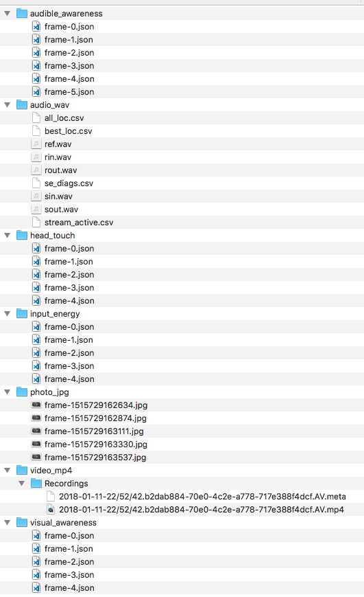

## Description
The set of python scripts records data from various platform services.  The main module `mainrecorder.py` launches a GUI where a user can select from the following types of data to record:

* audible_awareness from LPS service (type: websocket)
* visual_awareness from LPS service (type: websocket)
* input_energy from Audio service (type: websocket)
* head_touch from Body service (type: websocket)
* vad from jetstream service (type: websocket)
* events from jetstream service: hjheard and speakerid (type: websocket)
* photo_jpg from Media Service (type: continuous HTTP post/get)
* audio_wav from Audio Service (type: start/stop HTTP post)
* video_mp4 from Media Service (type: start/stop HTTP post)
* time_references (type: ssh commands)




* The `mainrecorder.py` is the main program that creates and manages the various types of recorders and launches a GUI.
* The `websocket_recorder.py` listens to a websocket and writes out a .json file of received messages at a specified rate.
* The `photo_recorder.py` continuously sends out HTTP post/get commands to the Media Service to get and write out jpg photos.
* The `http_recorder.py` is the parent class of the `video_recorder` and `audio_recorder.`  Its function is to send out start and stop recording HTTP posts.  
* The `video_recorder.py` send a request to the Media Service to create an mp4 video file (with both images and audio) on robot.  Once the recording is stopped, the files are rsync from the robot to the local computer.  
* The `audio_recorder.py` sends a request to the Audio Service to create an `audiolog.bin` binary file on robot.  Once the recording is stopped, the binary file is converted to various audio-related wav and data files.  These are then rsync-ed to the local computer.  
* The `time_recorder.py` saves a json file with the recording start and stop times and executes a ssh command on robot to grab the robot's boot time and its UTC system time.

### Installation
This program uses Python3 version 3.6.4 with the following libraries:
* requests (2.18.4)
* paramiko (2.4.0)
* scp (0.10.2)
* websocket (0.2.1)
* websocket-client (0.46.0)
* tcl-tk (8.6.8) 

To install python3 and tcl-tk:
```
brew install python3 --with-tcl-tk
```
To install the remaining packages:
```
pip3 install <package-name>
```

### Run Program
- **Step 0**: Push time script in `/resources` to robot
```
ssh root@{robot-ip} "jibo-mount --rw"
scp time root@{robot-ip}:/root
ssh root@{robot-ip} "chmod 755 /root/time"
ssh root@{robot-ip} "jibo-mount --ro"
```
- **Step 1**: Run the `mainrecorder.py` python program.  
```
$ python main_recorder.py -h
Usage: main_recorder [-h] [-r ROBOT] [-o DIRECTORY]
Example: python main_recorder.py -r seafoam-node-syrup-angora.local -o ~/Downloads/recordings

Optional arguments:
  -h, --help    show this help message and exit
  -r ROBOT      robot name (default: default robot from jibo robot-list or 172.24.84.101)
  -o DIRECTORY  output directory (default: ~/Desktop/recordings)
```
- **Step 2**: Select the checkboxes for which data you'd like to record
- **Step 3**: To start the recording session, _click_ the **start button**.  
The UI will update and show the recorders' running status.


- **Step 4**: To stop the recording session, _click_ the **stop button**.  
If either `audio_wav` or `video_mp4` are selected, _enter_ the ssh robot password `jibo` in the terminal (or not necessary if already added to ssh keys).  
A successful stop looks like the following:


- **Step 5**: To exit the program, _click_ the **exit button**.  

- **Step 6**: Check the output recordings folder.  Here is an example:


### !!!CAUTION!!!

Both the `audio_wav` and `video_mp4` recorders message the platform service to start a recording and save it on robot.  Therefore, if these services DO NOT receive the stop message, this recording will continue forever.  If the program is exited before a stop message is sent, then you will need to reboot the robot and manually delete the contents in `/opt/jibo/Recordings` on the robot.   

### Helpful Notes

- The video mp4 file can be opened using VLC: https://www.videolan.org/vlc/index.html

### Troubleshooting

- If the `audio_wav` recorder does not generate any recorded content.  Check to see if the `/tmp` folder on the robot is full via the `df -h` command.  If the Use% column for `/tmp` is 100%, then reboot the robot. Whenever this folder is full, nothing will be allowed to be written until reboot. 