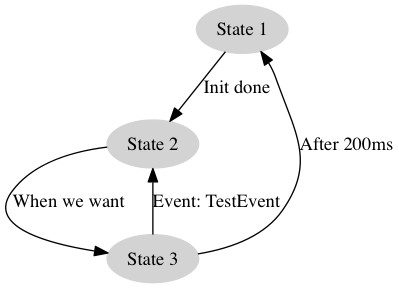

# jibo-state-machine

A simple state machine library.

#Usage

Here is an example of a simple state machine:



```js
import StateMachine from 'jibo-state-machine';
import {
  State,
  Transition,
  TimeoutTransition,
  InternalTransition,
  ImmediateTransition,
} from 'state-machine';

let sm = new StateMachine();

// Init some states
let s1 = new State(sm, 'State 1');
let s2 = new State(sm, 'State 2');
let s3 = new State(sm, 'State 3');

// Connect the states with transitions
s1.addTransition(new ImmediateTransition('Init done', s2));
s2.addTransition(new InternalTransition('When we want', s3));
s3.addTransition(new TimeoutTransition('After 200ms', s1, 200));
s3.addEventTransition('TestEvent', s2);

// Here we start implementing the logic of the states
s1.onEntry = (transition, result) => console.log('Entering state 1');
s1.onExit = (transition) => console.log('Exiting state 1');

s2.onEntry = (transition, result) => {
  if (someCondition) {
    s2.transitionTo(s3); // This can only be done for InternalTransitions
  }
};

// Here we start the state machine
sm.start();

// Creates events that trigger Event transitions
sm.emit('TestEvent');

// We can retrieve a convenient state/transition trace
let trace = sm.getTrace();
console.log(sm.traceToString());

// This creates a dot file which can be rendered into a PNG using graphviz
sm.toDotFile('test.dot');

```

#Creating graphic
To render the state diagram graphic, you need to call `sm.toDotFile(path);` somewhere in your code. You can then use any .dot renderer to render the .dot file to an image.
Here is an example with Grahpviz (can be obtained via Homebrew with `brew install graphviz`)

```
dot -Tpng -O path/to/file.dot
```

