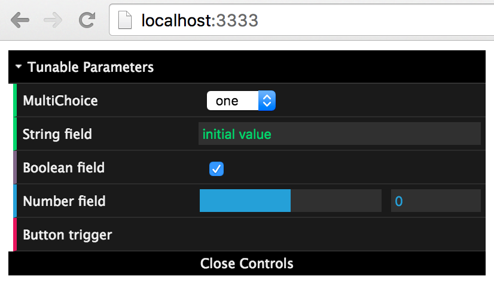
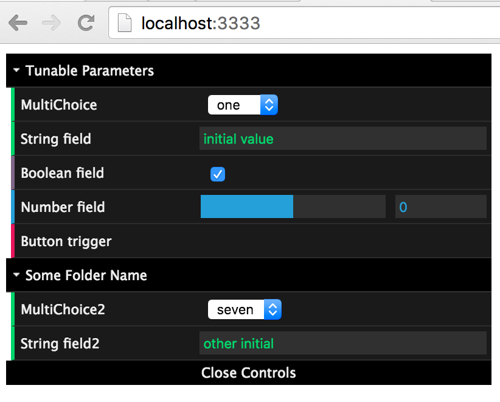

# Tunable

## Description

A library to add web accessible GUI to your project for tuning runtime parameters, trigger button actions, and get debug information.

In your project, use methods like `Tunable.getNumberField(...)` to get a numeric slider available at `http://localhost:3333`.

## How to build / run

 - To setup: `npm install`
 - To build: `gulp debug`
 - To test: `gulp test`

## Examples

### Creating fields
We can create String, Dropdown, Checkbox, Number, and Button fields. Each populates a web hosted GUI.

```js
import { Tunable } from 'jibo-tunable';

let dropField = 	Tunable.getDropdownField('MultiChoice', ['one', 'two', 'three']);
let stringField = 	Tunable.getStringField('String field', 'initial value');
let checkboxField = Tunable.getCheckboxField('Boolean field', true);
let numberField = 	Tunable.getNumberField('Number field', 0, -10, 10);
let buttonField = 	Tunable.getButtonField('Button trigger');
```

### Interface
The interface is accessible using any browser (on the same or a different computer) and is by default accessible at `http://localhost:3333` (port can be changed, replace with ip address if remote).



### Polling values
We can poll a field for its current value either by reference to the field itself or using static access to just the field name.

```js
let number = numberField.current;
let sameNumber = Tunable.getValue('Number field');
```

### Synchronized both ways
If values are changed in any remote client (webpage) it gets changed in the field value `current`. And if the field value `current` is changed, the change is forwarded to all remote clients.

```js
numberField.current = 5; // Forwarded to all clients
numberField.current = 100; // Throws Error since out of specified bounds
```

### Subscribing listeners
Handlers can be subscribed to any remote value change.

```js
dropField.events.change.on( (newValue: string) => {
	console.log(`New dropdown value: ${newValue}`)
});

buttonField.events.change.on( () => {
	console.log(`Button pressed`)
});
```

### Organized by folders
Fields can be organized in named folders. The default folder is "Tunable Parameters".

```js
let folderName = 'Some Folder Name';
let dropField2 = Tunable.getDropdownField('MultiChoice2', ['seven', 'eight'], 0, folderName);
let stringField2 = Tunable.getStringField('String field2', 'other initial', folderName);
```


